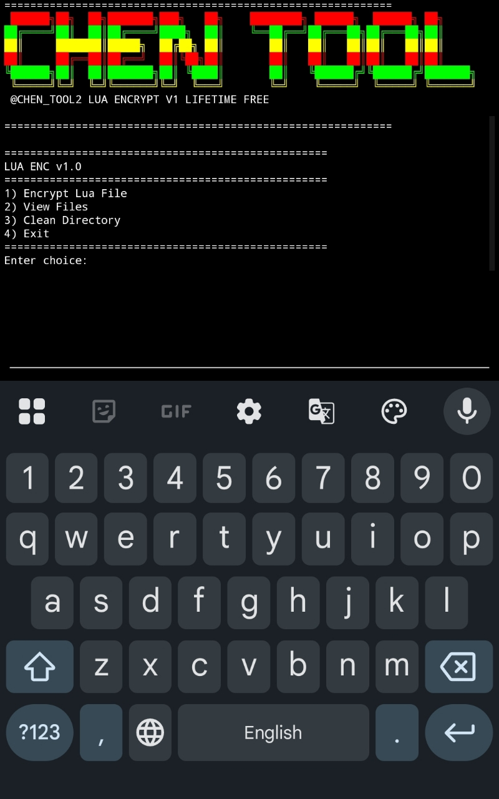

```markdown
# 🔥 ENCRYPTER v1.0 – SECURE LUA ENCRYPTER 🔥

<div align="center">

[](https://github.com/CHEN_TOOL2)
[](https://python.org)
[](LICENSE)
[]()

</div>

---

## 📸 SCREENSHOT
 
<div align="center">
  

 
</div>

---

## 🛡️ **FEATURES**

- **Lua File Encryption**: Encrypt Lua scripts using string conversion
- **Colorful Interface**: Dynamic color themes for better user experience
- **File Management**: View and manage files in the working directory
- **Cross-Platform**: Works on Termux, Linux, and Windows

---

## 📂 DEFAULT WORKING DIRECTORY
 
```

/storage/emulated/0/Download/LUA_ENC/

```
 
💡 Place your .lua files inside this folder before encryption.

---

## 🚀 INSTALLATION

### Termux Installation

```bash
# Update packages
pkg update && pkg upgrade -y

# Install required packages
pkg install python -y
pkg install python-pip -y
pkg install git -y

# Install Python modules
pip install requests

# Clone repository
git clone https://github.com/CHEN_LITE/LUA_ENC.git
cd LUA_ENC

# Run Tool
chmod +x *
./luaenc
```

Linux Installation

```bash
sudo apt update && sudo apt upgrade -y
sudo apt install python3 python3-pip git -y
pip3 install requests
git clone https://github.com/CHEN_LITE/LUA_ENC.git
cd LUA_ENC
chmod +x luaenc
python3 luaenc
```

---

📢 JOIN OUR COMMUNITY

Platform Link
▶️ YouTube https://youtube.com/@4am-chen
📡 Telegram https://t.me/+L7eG4ZAQ9nI1ODM1
💬 DM Owner @CHEN_TOOL2™

---

⚠️ DISCLAIMER

This tool is for educational & authorized security testing only.
Do not use on code you do not own. Author is not responsible for misuse.

---

<div align="center">

💯 High-Level Security | Powerful Encryption 🔒
🔥 VERSION v1.0 🔥

⭐ Star this repo if you found it useful ⭐

Made with ❤️ by CHEN_TOOL2™

</div>
```
